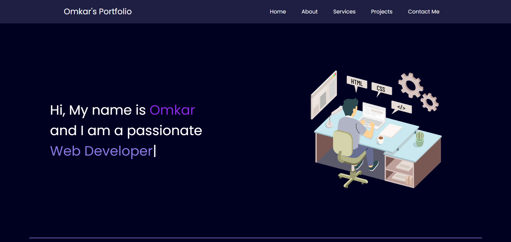
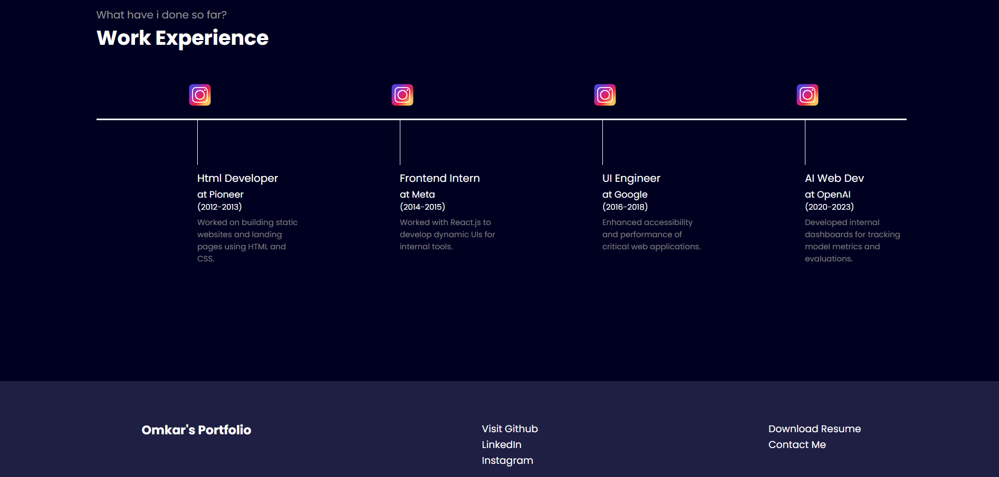

# 💼 Sample Personal Portfolio Website

This is a **simple portfolio website** created using **HTML, CSS, and JavaScript**. It showcases a personal introduction, work experience , dummy data is used for illustration.

---

## 🚀 Technologies Used

- HTML - basic structure
- CSS - styling 
- JavaScript - Leveraged JavaScript to store work experience as an array of objects and dynamically populate the website content using a forEach loop for optimized rendering.

---

## 📂 Screenshots

---

